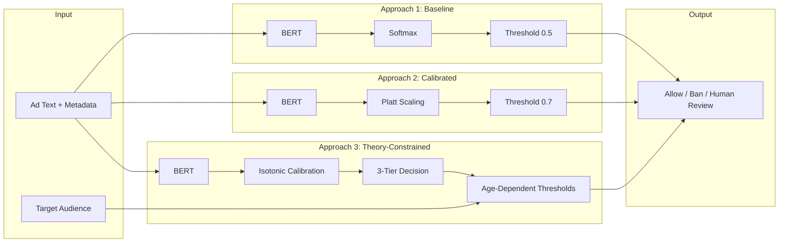

# Weapons Detection Content Moderation System

**Theory-constrained calibration and cost-sensitive moderation for high-stakes trust & safety.**

---

## STAR Narrative

- **Situation:** User-generated ad marketplaces face prohibited weapons sales (firearms, explosives, tactical gear). Missed ads create public safety and legal risk; wrongful bans harm users and platform reputation. Decisions must be calibrated and cost-aware.
- **Task:** Detect weapons-related ads with calibrated uncertainty and human-in-the-loop design, while minimizing total cost (false negatives × safety cost + false positives × user cost) and respecting stricter liability for content targeting minors.
- **Action:** We implemented and compared three approaches: (1) baseline BERT with 0.5 threshold, (2) BERT + Platt-scaling calibration with 0.7 threshold, and (3) a theory-constrained system with Isotonic calibration, 3-tier decisions (auto-ban / human review / allow), and age-dependent thresholds. Evaluation uses ECE, MCE, Brier score, and a business cost simulator.
- **Result:** The theory-constrained system provides better-calibrated probabilities, transparent 3-tier actions (reducing automation bias), and configurable cost trade-offs. The dashboard supports live detection, calibration analysis, business impact simulation, and drift monitoring for production use.

---

## Architecture (Mermaid)



**3-Tier decision flow (Approach 3):**

- **Score > 0.90** → Auto-ban  
- **Score 0.40–0.90** (or 0.30–0.90 for minors) → Human review queue  
- **Score < 0.40** (or < 0.30 for minors) → Allow with monitoring  

---

## Why Calibration and Cost-Sensitivity Matter

- **Calibration (Guo et al., 2017; Platt, 1999):** When we threshold on “P(weapons)”, that number should match actual frequencies. Miscalibration leads to over- or under-confidence and poor decisions. We use reliability diagrams, ECE, MCE, and Brier score to measure and improve calibration.
- **Cost-sensitive learning (Elkan, 2001):** The cost of a missed weapons ad (false negative) is much higher than the cost of a wrongful ban (false positive). We encode this via cost matrices and, in the theory-constrained design, via age-dependent thresholds (stricter for content targeting minors).
- **Human-in-the-loop (Dietvorst et al., 2015):** The 3-tier design keeps high-uncertainty cases in a human review queue instead of auto-banning, reducing automation bias while still blocking high-confidence violations.

---

## Installation

```bash
cd gun-ad-detection
python -m venv .venv
.venv\Scripts\activate   # Windows
# source .venv/bin/activate  # Linux/Mac
pip install -r requirements.txt
```

---

## Usage

**Generate synthetic data (optional; app will generate if missing):**

```bash
python -m data.synthetic_ads
```

**Run the Streamlit app:**

```bash
streamlit run app.py
```

Then open the URL shown (e.g. `http://localhost:8501`). Use the five tabs:

1. **The Three Approaches** — Side-by-side comparison, cost matrix, calibration curves.  
2. **Live Detection Demo** — Paste ad copy, choose audience, see scores and decisions.  
3. **Calibration Analysis** — Reliability diagrams, ECE/MCE/Brier, probability histograms.  
4. **Business Impact Simulator** — Sliders for FN/FP cost, volume, human review cost; cost comparison.  
5. **Monitoring & Drift** — Simulated KL divergence over time, drift alert, demographic parity (FP by age targeting).  

---

## Business Impact Calculator (Tab 4)

- **Cost of False Negative:** Dollar cost per missed weapons ad (e.g. legal/safety).  
- **Cost of False Positive:** Dollar cost per wrongful ban (e.g. support, reputation).  
- **Ad volume:** Daily ad volume to scale validation-set counts.  
- **Human review cost:** $/hour for reviewers.  

The app scales validation-set FN/FP counts to your volume and shows estimated daily cost for each approach, including human review queue size for Approach 3.

---

## Project Structure

```
gun-ad-detection/
├── app.py                 # Streamlit app (5 tabs)
├── config.py              # Thresholds, costs, paths
├── requirements.txt
├── README.md
├── weapons_detection_analysis.ipynb
├── data/
│   ├── synthetic_ads.py   # Synthetic ad dataset generator
│   └── cost_matrices.py  # FN/FP costs by audience
├── approaches/
│   ├── baseline_model.py
│   ├── calibrated_model.py
│   └── theory_constrained_model.py
├── evaluation/
│   ├── calibration_metrics.py  # ECE, MCE, Brier, reliability data
│   ├── cost_analysis.py
│   └── drift_detection.py     # KL, PSI, drift flag
└── visualization/
    ├── calibration_plots.py
    └── dashboard_components.py
```

---

## Disclaimer

*Generative AI assisted with code scaffolding, Streamlit components, and synthetic data generation. All theoretical frameworks (cost-sensitive learning, calibration theory, automation bias prevention), threshold selection rationale, and safety-critical evaluation protocols were centrally directed by risk management principles and content moderation best practices.*

---

## License

Use under your organization’s policy. No warranty for production safety-critical use without full validation and governance review.
